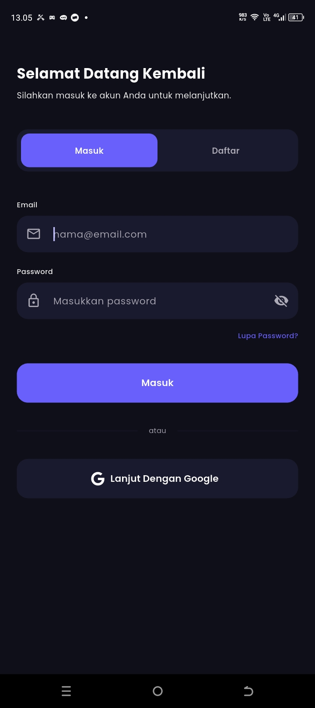
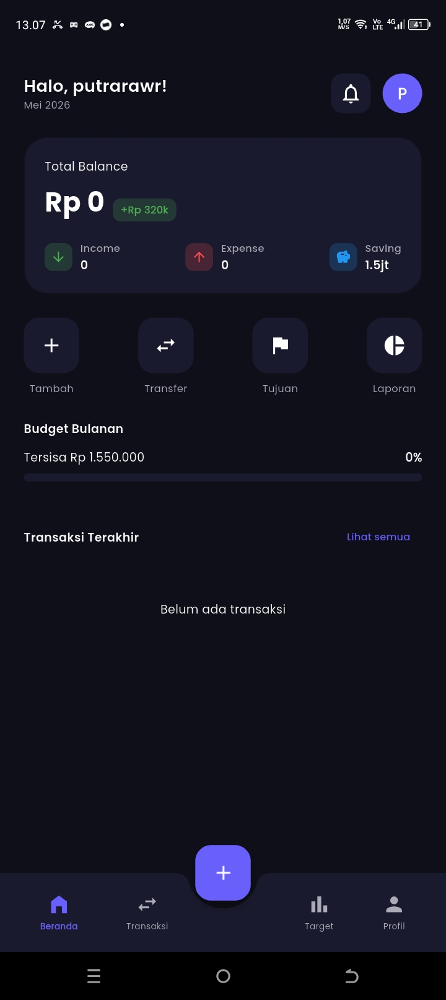
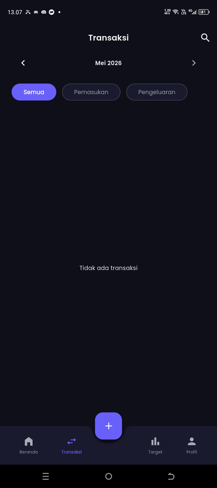
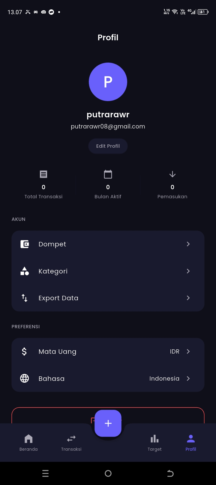

# 💸 FlowWallet

Aplikasi manajemen keuangan pribadi berbasis Flutter. Pantau pemasukan, pengeluaran, dan saldo kamu dengan mudah — semua tersimpan lokal di HP kamu.

## 📱 Screenshots

<p float="left">
  
  
  
  
</p>

## ✨ Fitur Utama

| Fitur | Deskripsi |
|-------|-----------|
| 🔐 Login | Google Sign-In & Email/Password via Firebase Auth |
| 📊 Dashboard | Ringkasan saldo, pemasukan, dan pengeluaran bulan ini |
| ➕ Tambah Transaksi | Input pemasukan & pengeluaran dengan kategori dan catatan |
| 🗂️ Filter & Navigasi | Filter per bulan, per kategori (Pemasukan/Pengeluaran) |
| 🔍 Pencarian | Cari transaksi berdasarkan judul atau kategori |
| 🗑️ Hapus Transaksi | Swipe kiri untuk hapus dengan konfirmasi |
| 👤 Edit Profil | Ganti nama tampilan akun |
| 💾 Data Lokal | Semua transaksi tersimpan di SQLite per akun |
| 🔄 Auto Session | Tidak perlu login ulang setelah menutup aplikasi |

## 🛠️ Tech Stack

- **Flutter** — cross-platform UI framework
- **Firebase Authentication** — login Google & Email/Password
- **SQLite (sqflite)** — penyimpanan data lokal per user
- **Provider** — state management
- **Google Fonts + Font Awesome** — tipografi dan ikon

## 🚀 Cara Menjalankan

### Prasyarat
- Flutter SDK `^3.x`
- Android Studio / VS Code
- Akun Firebase

### Langkah

1. **Clone repo**
   ```bash
   git clone https://github.com/username/flow_wallet.git
   cd flow_wallet
   ```

2. **Install dependencies**
   ```bash
   flutter pub get
   ```

3. **Konfigurasi Firebase**
   - Buat project di [Firebase Console](https://console.firebase.google.com)
   - Aktifkan **Authentication** → Google & Email/Password
   - Download `google-services.json` → taruh di `android/app/`
   - Daftarkan SHA-1 debug key di Project Settings → Your Apps

4. **Jalankan**
   ```bash
   flutter run
   ```

### Mendapatkan SHA-1 Debug Key
```bash
cd android
./gradlew signingReport
```
Copy nilai `SHA1` lalu tambahkan di Firebase Console → Project Settings → Your Apps → Add Fingerprint.

## 📁 Struktur Proyek

```
lib/
├── constants/
│   ├── colors.dart          # Palet warna aplikasi
│   └── text_styles.dart     # Definisi text style
├── models/
│   ├── transaction_model.dart
│   └── user_model.dart
├── providers/
│   ├── auth_provider.dart   # State autentikasi
│   └── transaction_provider.dart
├── screens/
│   ├── onboarding_screen.dart
│   ├── login_screen.dart
│   ├── main_screen.dart
│   ├── dashboard_screen.dart
│   ├── transactions_screen.dart
│   ├── add_transaction_screen.dart
│   └── profile_screen.dart
├── services/
│   ├── auth_service.dart    # Firebase Auth logic
│   └── database_service.dart # SQLite CRUD
├── utils/
│   ├── currency_formatter.dart
│   └── date_formatter.dart
└── widgets/
    └── transaction_tile.dart
```

## 🗄️ Skema Database

```sql
CREATE TABLE transactions (
  id       INTEGER PRIMARY KEY AUTOINCREMENT,
  uid      TEXT NOT NULL,   -- Firebase user ID
  title    TEXT,
  amount   REAL,
  category TEXT,
  type     TEXT,            -- 'income' | 'expense'
  date     TEXT,
  note     TEXT
);
```

Data setiap user terisolasi berdasarkan `uid` — satu HP bisa dipakai banyak akun tanpa data tercampur.

## 🔒 Keamanan

- Autentikasi dikelola sepenuhnya oleh Firebase Auth
- Data transaksi tersimpan lokal di device, tidak dikirim ke server
- Session tersimpan otomatis, aman selama akun Firebase aktif

## 📦 Dependencies Utama

```yaml
firebase_core: ^3.6.0
firebase_auth: ^5.3.1
google_sign_in: ^6.2.2
sqflite: ^2.3.0
provider: ^6.1.1
intl: ^0.19.0
```

## 📄 Lisensi

Project ini dibuat untuk keperluan pribadi / portofolio.
